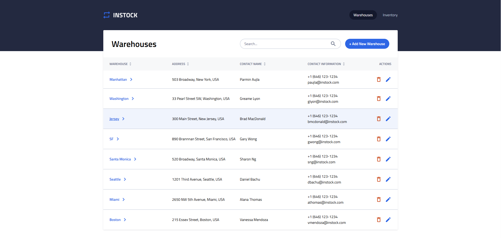

# In Stock

## Overview

A full stack, responsive inventory management web application.

## Features

The app holds information for a set of warehouses, each having its own inventory items.
User can add, delete, or modify inventory items and warehouses.

## Tech Stack

React.js and SCSS for front end
Node.js and express for back-end
MySQL and Knex.js for data base

## Screen Shots

